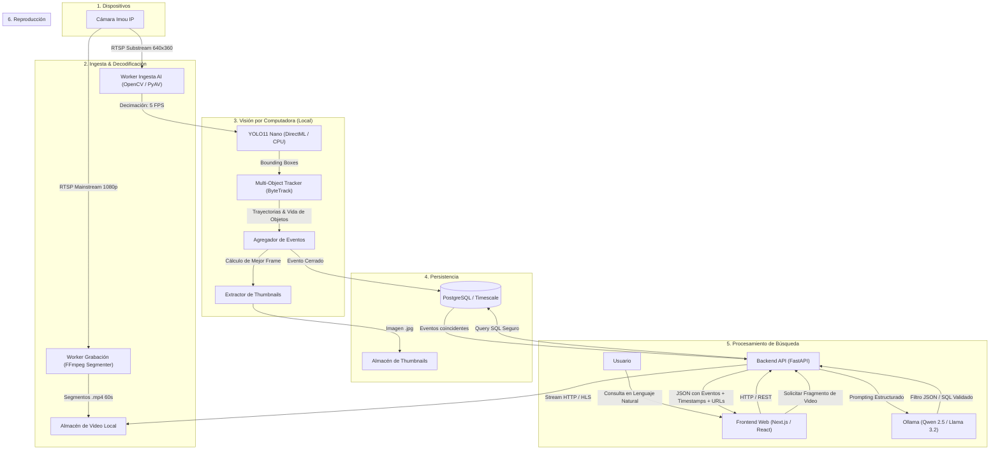

# 🏛️ Arquitectura del Sistema: Smart IP Camera AI Search

## 1. Visión General del Flujo

El objetivo fundamental es transformar una transmisión continua de video en un **registro histórico de eventos estructurados y consultables**, permitiendo búsquedas en lenguaje natural sin sobrecargar la computadora ni procesar video cuadro por cuadro con modelos de lenguaje masivos.



---

## 2. Decisiones de Hardware (AMD Radeon RX 7600 + Ryzen 7 5700G)

### Contexto de Hardware
* **CPU:** AMD Ryzen 7 5700G (8 núcleos / 16 hilos con instrucciones AVX2)
* **GPU:** AMD Radeon RX 7600 8 GB VRAM (Arquitectura RDNA 3, Windows 11)
* **RAM:** 16 GB DDR4
* **Restricción:** No se cuenta con NVIDIA CUDA en este equipo.

### Estrategia de Aceleración:
1. **YOLO (Detección continua):**
   * **Opción Principal — DirectML:** Utilizar `onnxruntime-directml` exportando el modelo YOLO (`yolo11n.onnx`). DirectML aprovecha la GPU AMD RX 7600 en Windows a través de DirectX 12 de forma nativa, consumiendo <250 MB de VRAM y procesando frames a >120 FPS.
   * **Opción Fallback — CPU AVX2:** El Ryzen 7 5700G procesa YOLO11n a más de 45 FPS en CPU pura utilizando PyTorch CPU o OpenVINO. Con una tasa de muestreo de **5 FPS**, el uso de CPU será de apenas un ~5-10%.
2. **Ollama (LLM de lenguaje):**
   * Ollama en Windows se ejecuta con soporte de aceleración GPU (Vulkan/ROCm) o AVX2 en CPU.
   * Modelo seleccionado: `qwen2.5:3b` o `qwen2.5:7b`. En Ryzen 5700G genera 25-40 tokens/segundo, más que suficiente para una consulta de búsqueda de 1 segundo.
3. **Presupuesto de Memoria (16 GB RAM):**
   * Windows + Background: ~4 GB
   * PostgreSQL: ~0.5 GB
   * Pipeline de Visión (OpenCV + YOLO + FFmpeg): ~1.5 GB
   * Ollama (Qwen 2.5 3B cuantizado Q4): ~2.5 GB
   * Backend FastAPI + Frontend Next.js: ~1 GB
   * **Margen Libre:** ~6.5 GB disponibles.

---

## 3. Estrategia de Ingesta Dual (Mainstream vs Substream)

Las cámaras IP Imou (fabricadas bajo la plataforma Dahua) emiten dos transmisiones RTSP simultáneas:

| Canal | Propósito | Resolución Típica | Tasa de Bits | Uso en la Plataforma |
|---|---|---|---|---|
| **Substream (`subtype=1`)** | Detección AI | 640x360 o 704x576 | ~512 kbps | Ingesta continua en Python, muestreo a 5 FPS para YOLO. Ahorra 75% de ancho de banda y cómputo. |
| **Mainstream (`subtype=0`)** | Grabación y Reproducción | 1920x1080 o 2K | ~2000-4000 kbps | FFmpeg guarda chunks continuos de 60 segundos en disco local sin recodificar (codec `copy`). Máxima nitidez visual. |

### Beneficios:
* YOLO no necesita procesar 1080p/2K (el modelo de cualquier manera redimensiona internamente a 640x640).
* Cuando el usuario hace clic en un resultado de búsqueda, el reproductor muestra el video en **Full HD 1080p** nativo grabado del Mainstream.

---

## 4. Ciclo de Vida del Evento y Anti-Spam (Tracking)

Uno de los problemas más comunes en videovigilancia es registrar un nuevo evento por cada cuadro donde aparece una persona, generando miles de registros falsos. Para solucionar esto:

```
[Frame T0] Persona detectada (Track ID: #42, Conf: 0.75) ──> Evento INICIADO en Memoria
[Frame T1..Tn] Persona sigue visible (Track ID: #42) ──> Se actualiza Bounding Box y Confianza
                                                      ──> Se guarda el frame de mayor nitidez (Crop)
[Frame Tn+1] Persona desaparece del cuadro
[Grace Period: 3s] Si no reaparece en 3s ──> Evento FINALIZADO
                                        ──> Se guarda en PostgreSQL:
                                            - Timestamp inicio y fin
                                            - Duración total
                                            - Clase ("person")
                                            - Thumbnail del mejor frame
                                            - Offset en el video grabado
```

---

## 5. Esquema de Base de Datos (PostgreSQL)

```sql
-- Cámaras configuradas
CREATE TABLE cameras (
    id UUID PRIMARY KEY DEFAULT gen_random_uuid(),
    name VARCHAR(100) NOT NULL,
    rtsp_url_main TEXT NOT NULL,
    rtsp_url_sub TEXT NOT NULL,
    location VARCHAR(150),
    status VARCHAR(20) DEFAULT 'connected',
    fps INT DEFAULT 25,
    resolution VARCHAR(30) DEFAULT '1920x1080',
    created_at TIMESTAMP WITH TIME ZONE DEFAULT NOW()
);

-- Segmentos de video grabados en disco (Rolling Buffer)
CREATE TABLE video_segments (
    id UUID PRIMARY KEY DEFAULT gen_random_uuid(),
    camera_id UUID REFERENCES cameras(id) ON DELETE CASCADE,
    file_path TEXT NOT NULL,
    start_time TIMESTAMP WITH TIME ZONE NOT NULL,
    end_time TIMESTAMP WITH TIME ZONE NOT NULL,
    duration_seconds REAL NOT NULL,
    size_bytes BIGINT NOT NULL,
    created_at TIMESTAMP WITH TIME ZONE DEFAULT NOW()
);

-- Eventos agregados por objeto detectado
CREATE TABLE events (
    id UUID PRIMARY KEY DEFAULT gen_random_uuid(),
    camera_id UUID REFERENCES cameras(id) ON DELETE CASCADE,
    track_id INT NOT NULL,
    object_class VARCHAR(50) NOT NULL, -- 'person', 'car', 'truck', 'bus', 'motorcycle', 'bicycle', 'dog', 'cat'
    confidence REAL NOT NULL,
    start_time TIMESTAMP WITH TIME ZONE NOT NULL,
    end_time TIMESTAMP WITH TIME ZONE NOT NULL,
    duration_seconds REAL NOT NULL,
    snapshot_path TEXT,
    video_segment_id UUID REFERENCES video_segments(id) ON DELETE SET NULL,
    video_offset_seconds REAL, -- Segundo exacto dentro del archivo de video
    metadata JSONB, -- { "direction": "inbound", "max_bbox_area": 12450, "estimated_color": "black" }
    created_at TIMESTAMP WITH TIME ZONE DEFAULT NOW()
);

-- Índices de alto rendimiento para búsqueda
CREATE INDEX idx_events_start_time ON events(start_time);
CREATE INDEX idx_events_class ON events(object_class);
CREATE INDEX idx_events_camera_time ON events(camera_id, start_time DESC);
```

---

## 6. Motor de Búsqueda Inteligente (LLM to Structured Query)

Cuando el usuario escribe en lenguaje natural:
> *"Mostrame los camiones o personas que pasaron hoy entre las 4 y las 6 de la tarde"*

El backend envía un prompt de sistema rígido a **Ollama**:
```json
{
  "system": "Eres un compilador de consultas para un sistema de videovigilancia. Convierte la intención del usuario a un filtro JSON estructurado. Fechas y horas relativas deben calcularse con respecto a NOW(). Clases válidas: ['person', 'car', 'truck', 'bus', 'motorcycle', 'bicycle', 'dog', 'cat'].",
  "user": "Mostrame los camiones o personas que pasaron hoy entre las 4 y las 6 de la tarde"
}
```

Respuesta estructurada del LLM:
```json
{
  "classes": ["truck", "person"],
  "time_range": {
    "start": "2026-10-06T16:00:00Z",
    "end": "2026-10-06T18:00:00Z"
  },
  "min_duration_seconds": 0,
  "confidence_threshold": 0.5
}
```

El backend valida los parámetros contra un esquema Pydantic seguro y ejecuta una consulta SQL indexada directamente en PostgreSQL. **Cero riesgos de alucinación o inyección SQL**.
